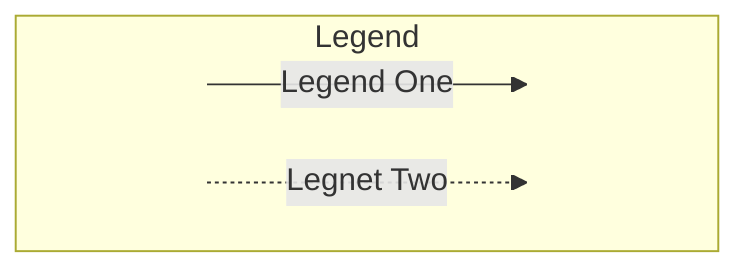

```mermaid
flowchart LR
  subgraph x [Legend]
    direction LR
    start1[ ] --> |Legend One| stop1[ ]      
    style start1 height:0px;
    style stop1 height:0px;
    start2[ ] -.->|Legnet Two| stop2[ ]
    style start2 height:0px;
    style stop2 height:0px;
  end
```
